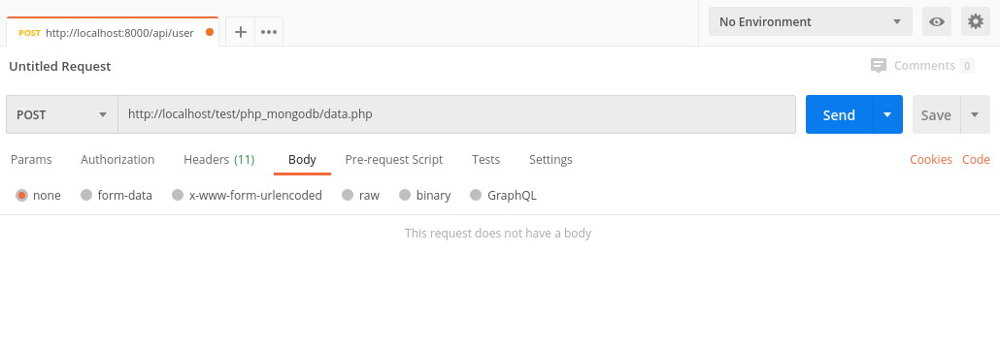
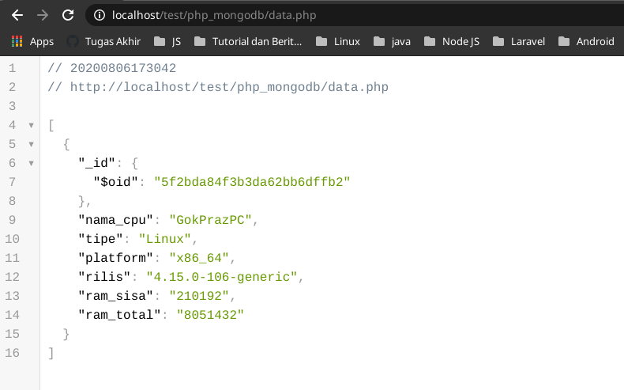

# PHP MongoDB Test

## POST

Sistem berhasil menambahkan data spesifikasi CPU tanpa menambahkan data pada body request yang terlampir pada <a href="https://github.com/gdevilbat/Ujian_Backend_Ajita_05#soal-2---php--mongodb">[ SOAL ]</a>

## GET

Sistem berhasil menampilkan data spesifikasi CPU yang sudah ditambahkan pada MongoDB sesuai dengan soal yang terlampir pada <a href="https://github.com/gdevilbat/Ujian_Backend_Ajita_05#soal-2---php--mongodb">[ SOAL ]</a>

## Route List
[ GET ] : `localhost/test/php_mongodb/data.php`

 

[ POST ] : `localhost/test/php_mongodb/data.php`